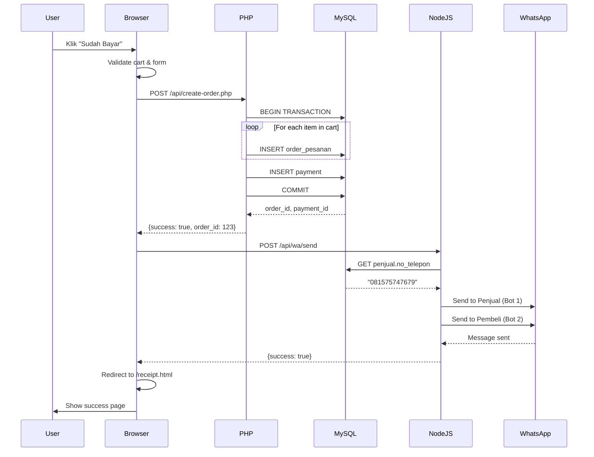
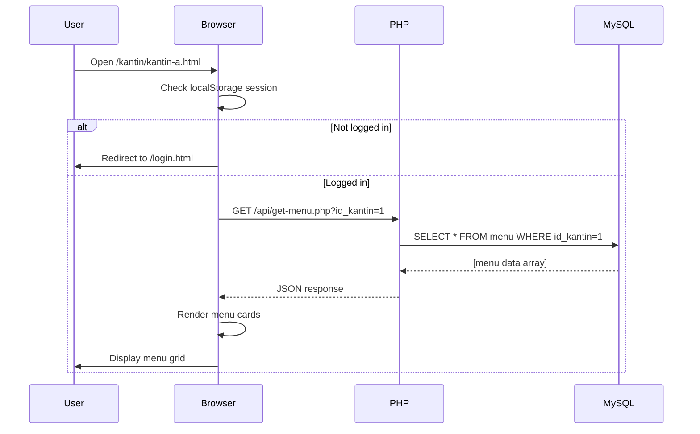
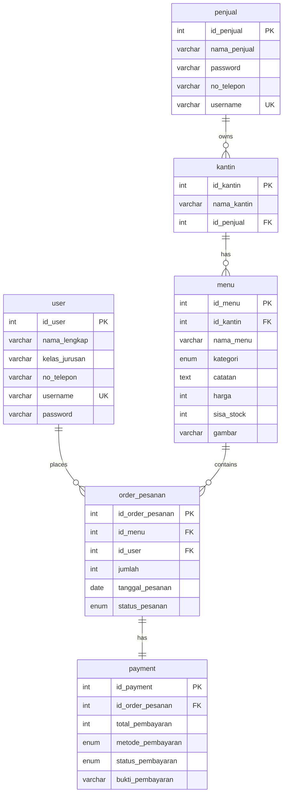

# PRD — Project Requirements Document
## E-Canteen: Figma to Frontend Implementation

---

## 1. Overview

### 1.1 Latar Belakang
Proyek E-Canteen bertujuan untuk mendigitalkan sistem pemesanan makanan dan minuman di lingkungan sekolah (SMK). Saat ini, proses pemesanan masih dilakukan secara manual yang menyebabkan antrian panjang, kesulitan dalam pencatatan pesanan, dan kurangnya transparansi stok.

### 1.2 Tujuan Proyek
Aplikasi ini dirancang untuk:
- Memudahkan siswa dalam memesan makanan/minuman tanpa harus antri panjang
- Memberikan notifikasi otomatis kepada penjual kantin saat ada pesanan baru
- Menyediakan sistem pembayaran digital (QRIS)
- Mencatat riwayat transaksi untuk pembeli dan penjual
- Meningkatkan efisiensi operasional kantin sekolah

### 1.3 Masalah yang Diselesaikan
- **Antrian Panjang:** Siswa tidak perlu antri karena bisa pesan via aplikasi
- **Pencatatan Manual:** Sistem otomatis mencatat setiap transaksi di database
- **Komunikasi:** WhatsApp bot otomatis menginformasikan pesanan ke penjual dan pembeli
- **Pembayaran:** Integrasi QRIS untuk cashless transaction
- **Transparansi Stok:** Penjual mendapat info stok real-time via notifikasi WA

### 1.4 Scope Proyek
Proyek ini fokus pada **konversi design Figma menjadi frontend web application** yang fully functional dengan tech stack:
- **Frontend:** HTML, CSS (Pure/Vanilla), JavaScript (Vanilla/ES6)
- **Backend:** PHP (MySQL CRUD) + Node.js (WhatsApp Bot)
- **Database:** MySQL (struktur sudah ada)
- **Integration:** WhatsApp Web API (whatsapp-web.js / baileys)

---

## 2. Requirements

### 2.1 Functional Requirements

#### 2.1.1 User Management
- **Registration:** User baru harus registrasi dengan data lengkap (nama, kelas, no. telepon, username, password)
- **Login:** Autentikasi menggunakan username dan password
- **Session Management:** Menyimpan session user di localStorage setelah login berhasil

#### 2.1.2 Kantin Management
- **Kantin Selection:** User dapat memilih dari 4 kantin yang tersedia
- **Dynamic Menu:** Menu ditampilkan secara dinamis berdasarkan kantin yang dipilih
- **Real-time Stock Info:** Informasi stok tersedia saat memesan (display only)

#### 2.1.3 Shopping Cart
- **Add to Cart:** User dapat menambahkan menu ke keranjang
- **Update Quantity:** User dapat mengubah jumlah pesanan
- **Remove Item:** User dapat menghapus item dari keranjang
- **Persistent Cart:** Cart disimpan di localStorage agar tidak hilang saat refresh

#### 2.1.4 Checkout & Payment
- **Order Review:** User melihat ringkasan pesanan sebelum checkout
- **Form Input:** User mengisi data pengambilan (nama, kelas, no. telepon)
- **QRIS Payment Only:** Metode pembayaran tunggal menggunakan QRIS
- **Payment Timer:** Countdown timer untuk batas waktu pembayaran

#### 2.1.5 WhatsApp Notification
- **Bot "E-Canteen Penjual":** Mengirim notifikasi pesanan baru ke penjual kantin
- **Bot "E-Canteen Pembeli":** Mengirim nota digital dan konfirmasi ke pembeli
- **Auto-send:** Pesan dikirim otomatis setelah user konfirmasi pembayaran

#### 2.1.6 Transaction History
- **Order History:** User dapat melihat riwayat pembelian mereka
- **Detail View:** Klik pesanan untuk melihat detail lengkap
- **Date Format:** Tanggal ditampilkan dalam format DD/MM/YYYY

### 2.2 Non-Functional Requirements

#### 2.2.1 Performance
- **Page Load Time:** Maksimal 3 detik untuk setiap halaman
- **API Response:** Fetch data dari database < 1 detik
- **Image Optimization:** Semua gambar produk optimized (max 500KB per file)

#### 2.2.2 Usability
- **Mobile-First Design:** Prioritas utama adalah pengalaman mobile (320px - 480px)
- **Responsive:** Support desktop view (1024px+)
- **Intuitive Navigation:** User flow yang jelas dan mudah dipahami
- **Accessibility:** Minimum contrast ratio 4.5:1 untuk text

#### 2.2.3 Security
- **Password Hashing:** Password disimpan dalam bentuk hash (MD5/SHA256/bcrypt)
- **SQL Injection Prevention:** Prepared statements untuk semua query
- **XSS Protection:** Sanitasi input user sebelum render ke DOM
- **Session Validation:** Validasi session di setiap protected page

#### 2.2.4 Compatibility
- **Browser Support:** Chrome 90+, Firefox 88+, Safari 14+, Edge 90+
- **No Framework Dependency:** Pure HTML/CSS/JS tanpa React, Vue, Tailwind, dll
- **PHP Version:** PHP 7.4+ dengan MySQLi/PDO
- **Node.js Version:** Node.js 16+ untuk WhatsApp bot

---

## 3. Core Features

### 3.1 Landing Page (/)
**Tujuan:** Memperkenalkan aplikasi E-Canteen kepada user dan mengarahkan ke registrasi/login

**Sections:**
1. **Hero Section (#beranda)**
   - Headline: "Pesan Makanan Kantin dengan Mudah"
   - CTA Button: "Mulai Pesan" → redirect ke /login
   - Background image: Ilustrasi siswa memesan makanan

2. **About Section (#tentang)**
   - Penjelasan singkat tentang E-Canteen
   - Keunggulan aplikasi (cepat, praktis, cashless)
   - Ilustrasi/icon pendukung

3. **How to Use (#cara-pakai)**
   - Step-by-step guide (4 langkah):
     1. Daftar/Login
     2. Pilih Kantin & Menu
     3. Bayar dengan QRIS
     4. Ambil Pesanan
   - Visual flow diagram

4. **Testimonials (#testimoni)**
   - 3-4 testimoni dari siswa/penjual
   - Foto profil + nama + kelas/kantin
   - Rating bintang (optional)

**Features:**
- Smooth scroll navigation antar section
- Sticky navbar dengan link ke #beranda, #tentang, #cara-pakai, #testimoni
- Mobile hamburger menu

---

### 3.2 Register Page (/register.html)
**Tujuan:** Pendaftaran user baru ke sistem

**Form Fields:**
- Nama Lengkap (text, required)
- Kelas & Jurusan (text, required, format: "X PPLG 2")
- No. Telepon (tel, required, format: 08xxxxxxxxxx)
- Username (text, required, unique)
- Password (password, required, min 6 karakter)
- Konfirmasi Password (password, required, harus match)

**Validation:**
- Username tidak boleh mengandung spasi
- No. telepon harus format Indonesia (08xxx)
- Password minimal 6 karakter
- Konfirmasi password harus sama dengan password

**Flow:**
```
User input data → Validasi frontend → 
POST ke /api/register.php → Insert ke tabel `user` → 
Redirect ke /login.html dengan success message
```

---

### 3.3 Login Page (/login.html)
**Tujuan:** Autentikasi user untuk akses sistem

**Form Fields:**
- Username (text, required)
- Password (password, required)
- Remember Me (checkbox, optional)

**Flow:**
```
User input credentials → POST ke /api/login.php → 
Validasi dari tabel `user` → 
Success: Simpan session di localStorage → Redirect ke /kantin.html
Failed: Show error message
```

**Session Data (localStorage):**
```javascript
{
  "user_id": 1,
  "nama_lengkap": "Keisha Putri",
  "kelas_jurusan": "X PPLG 2",
  "no_telepon": "088233073873",
  "username": "keikei",
  "logged_in": true,
  "login_time": "2026-04-30T14:30:00"
}
```

---

### 3.4 Kantin Selection (/kantin.html)
**Tujuan:** User memilih kantin yang ingin dipesan

**Layout:**
- Grid 2x2 untuk 4 kantin (mobile: 1 column, desktop: 2 columns)
- Card untuk setiap kantin berisi:
  - Foto kantin
  - Nama kantin
  - Nama penjual
  - Status (Buka/Tutup)
  - Button "Lihat Menu" → redirect ke /kantin/kantin-{id}.html

**Data Source:**
```sql
SELECT * FROM kantin 
JOIN penjual ON kantin.id_penjual = penjual.id_penjual
```

**Features:**
- Filter kantin yang sedang buka saja (optional)
- Disable button jika status = "tutup"

---

### 3.5 Menu Dashboard (/kantin/kantin-a.html, kantin-b.html, dll)
**Tujuan:** Menampilkan menu kantin dan memungkinkan user menambahkan ke cart

**Layout Sections:**

1. **Header Bar**
   - Back button → kembali ke /kantin.html
   - Nama kantin (dynamic)
   - Cart icon dengan badge jumlah item

2. **User Profile Section**
   - Avatar/icon user
   - Nama user (dari localStorage)
   - Kelas user

3. **Category Filter**
   - Tab: "Semua", "Makanan", "Minuman"
   - Filter menu berdasarkan kategori

4. **Menu Grid**
   - Card untuk setiap menu berisi:
     - Foto menu
     - Nama menu
     - Harga (format: Rp x.xxx)
     - Stok tersisa (display only)
     - Button "+" untuk add to cart

5. **Floating Cart Button**
   - Fixed di bottom
   - Show total item & total harga
   - Klik untuk ke /checkout.html

**Data Source:**
```sql
SELECT * FROM menu 
WHERE id_kantin = ? 
ORDER BY kategori, nama_menu
```

**Cart Logic (localStorage):**
```javascript
// Structure
{
  "kantin_id": 1,
  "kantin_nama": "Kantin Mak E",
  "items": [
    {
      "id_menu": 1,
      "nama_menu": "Nasi Geprek",
      "harga": 7000,
      "quantity": 2,
      "gambar": "nasi_geprek.jpg",
      "stok_tersisa": 10
    }
  ],
  "total_items": 2,
  "total_harga": 14000
}
```

**Features:**
- Add to cart dengan animasi
- Update badge cart real-time
- Prevent add jika stok = 0
- Category filter menggunakan JavaScript (tanpa reload)

---

### 3.6 Checkout Page (/checkout.html)
**Tujuan:** Review pesanan dan input data pengambilan

**Layout Sections:**

1. **Order Summary**
   - List semua item di cart
   - Nama menu, quantity, harga per item
   - Subtotal per item
   - Grand total

2. **Edit Cart**
   - Button "+" dan "-" untuk update quantity
   - Button "Hapus" untuk remove item
   - Update total otomatis

3. **Form Informasi Pesanan**
   - Nama Lengkap (auto-fill dari localStorage)
   - Kelas & Jurusan (auto-fill)
   - No. Telepon (auto-fill)
   - Catatan Pesanan (textarea, optional)

4. **Payment Method**
   - Radio button: QRIS (checked, disabled)
   - Text: "Pembayaran Cash tidak tersedia"

5. **Total Section**
   - Subtotal
   - Grand Total
   - Button "Proses Pembayaran" → redirect ke /payment-qris.html

**Validation:**
- Cart tidak boleh kosong
- Semua field wajib terisi (kecuali catatan)
- No. telepon valid

**Flow:**
```
User review cart → Edit quantity/remove item (optional) → 
Fill form → Klik "Proses Pembayaran" → 
Simpan data ke sessionStorage → Redirect ke /payment-qris.html
```

---

### 3.7 Payment QRIS (/payment-qris.html)
**Tujuan:** User melakukan pembayaran via QRIS

**Layout Sections:**

1. **Header**
   - Title: "Pembayaran QRIS"
   - Order ID (auto-generated: #ORD-YYYYMMDD-XXX)

2. **QRIS Display**
   - QR Code image (dynamic/static based on implementation)
   - Nominal pembayaran (besar, highlight)
   - Instruksi: "Scan QR Code dengan aplikasi e-wallet"

3. **Timer Countdown**
   - Countdown dari 15 menit (00:15:00)
   - Text: "Selesaikan pembayaran dalam"
   - Auto-redirect ke /kantin.html jika waktu habis

4. **Payment Confirmation**
   - Button "Sudah Bayar" → trigger WhatsApp notification
   - Button "Batal" → kembali ke /checkout.html

**Flow:**
```
Page load → Start countdown timer → 
User scan QRIS & bayar (external) → 
User klik "Sudah Bayar" → 
INSERT order ke database → 
Trigger WhatsApp bot (2 messages) → 
Redirect ke /receipt.html
```

**Database Insert:**
```sql
-- Insert order_pesanan
INSERT INTO order_pesanan 
(id_menu, id_user, jumlah, tanggal_pesanan, status_pesanan)
VALUES (?, ?, ?, NOW(), 'diproses');

-- Insert payment
INSERT INTO payment 
(id_order_pesanan, total_pembayaran, metode_pembayaran, status_pembayaran)
VALUES (?, ?, 'qris', 'pembayaran_dikonfirmasi');
```

---

### 3.8 Receipt Page (/receipt.html)
**Tujuan:** Menampilkan bukti pemesanan setelah pembayaran berhasil

**Layout Sections:**

1. **Success Icon**
   - Checkmark icon besar
   - Text: "Pesanan Berhasil!"

2. **Order Details**
   - Order ID
   - Tanggal & Waktu Pesanan
   - Nama Pembeli
   - Kelas
   - No. Telepon

3. **Items Ordered**
   - List semua item yang dipesan
   - Quantity & harga

4. **Payment Info**
   - Metode: QRIS
   - Total Pembayaran
   - Status: "Dikonfirmasi"

5. **Pickup Info**
   - Lokasi Pengambilan: {Nama Kantin}
   - Estimasi Siap: 15-20 menit
   - Text: "Tunjukkan halaman ini saat mengambil pesanan"

6. **Action Buttons**
   - Button "Lihat Riwayat" → /riwayat.html
   - Button "Pesan Lagi" → /kantin.html

**Features:**
- Data diambil dari sessionStorage atau query parameter
- Screenshot-friendly layout
- Print button (optional)

---

### 3.9 History Page (/riwayat.html)
**Tujuan:** Menampilkan riwayat pembelian user

**Layout:**

1. **Header**
   - Title: "Riwayat Pembelian"
   - Filter dropdown: "Semua", "Diproses", "Siap Diambil"

2. **Order List**
   - Card untuk setiap transaksi berisi:
     - Order ID
     - Tanggal (format: DD/MM/YYYY)
     - Nama Kantin
     - Total Item
     - Total Harga
     - Status Pesanan (badge)
     - Button "Lihat Detail" → expand card

3. **Detail View (Expandable)**
   - List item yang dipesan
   - Quantity & harga per item
   - Metode pembayaran
   - Status pembayaran

4. **Empty State**
   - Icon + Text: "Belum ada riwayat pembelian"
   - Button "Mulai Pesan" → /kantin.html

**Data Source:**
```sql
SELECT op.*, m.nama_menu, m.harga, k.nama_kantin, p.metode_pembayaran, p.status_pembayaran
FROM order_pesanan op
JOIN menu m ON op.id_menu = m.id_menu
JOIN kantin k ON m.id_kantin = k.id_kantin
JOIN payment p ON op.id_order_pesanan = p.id_order_pesanan
WHERE op.id_user = ?
ORDER BY op.tanggal_pesanan DESC
```

**Features:**
- Infinite scroll atau pagination (max 20 per page)
- Filter by status
- Pull-to-refresh (mobile)

---

## 4. User Flow

### 4.1 First Time User Journey
```
Landing Page (/) 
  → Baca tentang E-Canteen
  → Klik "Mulai Pesan"
  → Redirect ke /register.html
  → Isi form registrasi
  → Submit → Success
  → Redirect ke /login.html
  → Login dengan credentials baru
  → Redirect ke /kantin.html
  → Pilih kantin
  → Browse menu
  → Add to cart
  → Checkout
  → Payment QRIS
  → Konfirmasi pembayaran
  → Receive WhatsApp notification
  → View receipt
  → Ambil pesanan di kantin
```

### 4.2 Returning User Journey
```
Landing Page (/) atau Direct to /login.html
  → Login
  → Redirect ke /kantin.html (or last visited page)
  → Pilih kantin
  → Add to cart
  → Checkout
  → Payment
  → Receipt
```

### 4.3 Order Placement Flow (Detail)
```
1. Browse Menu (/kantin/kantin-a.html)
   ↓
2. Add items to cart (klik button "+")
   ↓
3. Cart counter update (badge di header)
   ↓
4. Klik "Lihat Keranjang" atau cart icon
   ↓
5. Redirect ke /checkout.html
   ↓
6. Review pesanan (edit quantity/remove item)
   ↓
7. Auto-fill form informasi dari localStorage
   ↓
8. Klik "Proses Pembayaran"
   ↓
9. Redirect ke /payment-qris.html
   ↓
10. Timer start countdown (15 menit)
   ↓
11. User scan QRIS & bayar (external process)
   ↓
12. User klik "Sudah Bayar"
   ↓
13. Frontend → POST /api/create-order.php
    - Insert order_pesanan (per item)
    - Insert payment (1 record)
    - Return order_id
   ↓
14. Frontend → POST /api/whatsapp-send.php
    - Trigger Bot "E-Canteen Penjual"
    - Trigger Bot "E-Canteen Pembeli"
   ↓
15. Redirect ke /receipt.html?order_id={id}
   ↓
16. Display receipt dengan data dari sessionStorage
   ↓
17. User dapat "Lihat Riwayat" atau "Pesan Lagi"
```

### 4.4 WhatsApp Notification Flow
```
User konfirmasi pembayaran
  ↓
Frontend → POST /api/whatsapp-send.php
  ↓
Node.js Server receive request
  ↓
├─ Bot "E-Canteen Penjual"
│   ↓
│   Get penjual phone number dari database (kantin.id_penjual → penjual.no_telepon)
│   ↓
│   Format pesan dengan data:
│   - Nama kantin
│   - Order ID
│   - Data pembeli (nama, kelas, no_telepon)
│   - Detail pesanan (menu, quantity, harga)
│   - Total pembayaran
│   - Waktu order
│   - Info stok terkini
│   ↓
│   Send via WhatsApp Web API
│   ↓
│   Log to database (optional)
│
└─ Bot "E-Canteen Pembeli"
    ↓
    Get user phone number dari form checkout
    ↓
    Format pesan dengan data:
    - Nama pembeli
    - Order ID
    - Detail pesanan
    - Total pembayaran
    - Lokasi pengambilan
    - Estimasi waktu siap
    ↓
    Send via WhatsApp Web API
    ↓
    Log to database (optional)
```

---

## 5. Architecture

### 5.1 System Architecture Diagram

```
┌─────────────────────────────────────────────────────────┐
│                   USER INTERFACE LAYER                  │
│                                                         │
│  ┌──────────┐  ┌──────────┐  ┌──────────┐             │
│  │   HTML   │  │   CSS    │  │    JS    │             │
│  │  Pages   │  │  Styles  │  │  Logic   │             │
│  └──────────┘  └──────────┘  └──────────┘             │
│       │              │              │                   │
└───────┼──────────────┼──────────────┼───────────────────┘
        │              │              │
        └──────────────┴──────────────┘
                       │
        ┌──────────────┴──────────────┐
        │                             │
        ▼                             ▼
┌──────────────┐            ┌──────────────────┐
│  PHP Backend │            │ Node.js Server   │
│              │            │                  │
│ ┌──────────┐ │            │ ┌──────────────┐ │
│ │MySQL CRUD│ │            │ │  WA Bot 1:   │ │
│ │   API    │ │            │ │  Pembeli     │ │
│ └──────────┘ │            │ └──────────────┘ │
│              │            │                  │
│ Endpoints:   │            │ ┌──────────────┐ │
│ - register   │            │ │  WA Bot 2:   │ │
│ - login      │            │ │  Penjual     │ │
│ - kantin     │            │ └──────────────┘ │
│ - menu       │            │                  │
│ - order      │            │ Libraries:       │
│ - history    │            │ - whatsapp-web.js│
│              │            │ - qrcode-terminal│
└──────┬───────┘            └────────┬─────────┘
       │                             │
       ▼                             ▼
┌─────────────┐            ┌──────────────────┐
│   MySQL DB  │            │  WhatsApp Web    │
│             │            │                  │
│ Tables:     │            │ - Send to Penjual│
│ - user      │            │ - Send to Pembeli│
│ - penjual   │            │                  │
│ - kantin    │            └──────────────────┘
│ - menu      │
│ - order     │
│ - payment   │
└─────────────┘

┌─────────────────────────────────────────────────────────┐
│                CLIENT-SIDE STORAGE                      │
│                                                         │
│  localStorage:                                          │
│  - User Session (id, nama, kelas, no_telepon)          │
│  - Shopping Cart (items, total)                        │
│                                                         │
│  sessionStorage:                                        │
│  - Checkout Data (order details for receipt)           │
│  - Payment Timer State                                 │
└─────────────────────────────────────────────────────────┘
```

### 5.2 Data Flow Diagram

#### 5.2.1 Order Creation Flow


#### 5.2.2 Menu Loading Flow


### 5.3 Component Architecture

```
┌─────────────────────────────────────────────────────────┐
│                    REUSABLE COMPONENTS                  │
└─────────────────────────────────────────────────────────┘

1. Navigation Component (navigation.js)
   - Sticky navbar
   - Hamburger menu (mobile)
   - Active link highlight
   - Smooth scroll to sections

2. Product Card Component (menu.js)
   - Product image
   - Product name & price
   - Stock indicator
   - Add to cart button
   - Out of stock state

3. Cart Item Component (cart.js)
   - Item thumbnail
   - Item name, price, quantity
   - Increment/decrement buttons
   - Remove button
   - Subtotal display

4. Modal Component (components.js)
   - Generic modal wrapper
   - Close button
   - Overlay background
   - Used for: confirmations, alerts, image preview

5. Loading Spinner Component (components.js)
   - Centered spinner
   - Overlay background
   - Show during API calls

6. Toast Notification Component (components.js)
   - Success/error/info states
   - Auto-dismiss after 3 seconds
   - Stack multiple toasts

7. Empty State Component (components.js)
   - Icon + message
   - CTA button
   - Used for: empty cart, no history, no results
```

---

## 6. Database Schema

### 6.1 Entity Relationship Diagram (ERD)



### 6.2 Table Descriptions

#### 6.2.1 Table: `user`
**Purpose:** Menyimpan data pembeli (siswa)

| Column | Type | Constraint | Description |
|--------|------|------------|-------------|
| id_user | INT | PRIMARY KEY, AUTO_INCREMENT | ID unik user |
| nama_lengkap | VARCHAR(20) | NOT NULL | Nama lengkap siswa |
| kelas_jurusan | VARCHAR(20) | NOT NULL | Kelas & jurusan (contoh: X PPLG 2) |
| no_telepon | VARCHAR(20) | NOT NULL | Nomor telepon WhatsApp |
| username | VARCHAR(20) | NOT NULL, UNIQUE | Username untuk login |
| password | VARCHAR(20) | NOT NULL | Password (hashed) |

#### 6.2.2 Table: `penjual`
**Purpose:** Menyimpan data pemilik kantin

| Column | Type | Constraint | Description |
|--------|------|------------|-------------|
| id_penjual | INT | PRIMARY KEY, AUTO_INCREMENT | ID unik penjual |
| nama_penjual | VARCHAR(20) | NOT NULL | Nama penjual |
| password | VARCHAR(12) | NOT NULL | Password dashboard penjual |
| no_telepon | VARCHAR(20) | NOT NULL | Nomor WA untuk terima notifikasi |
| username | VARCHAR(20) | NOT NULL, UNIQUE | Username penjual |

#### 6.2.3 Table: `kantin`
**Purpose:** Menyimpan data kantin yang tersedia

| Column | Type | Constraint | Description |
|--------|------|------------|-------------|
| id_kantin | INT | PRIMARY KEY, AUTO_INCREMENT | ID unik kantin |
| nama_kantin | VARCHAR(20) | NOT NULL | Nama kantin (contoh: kantin_mak_e) |
| id_penjual | INT | FOREIGN KEY | Relasi ke penjual |

**Note:** Untuk menambahkan fitur status buka/tutup, perlu ALTER TABLE:
```sql
ALTER TABLE kantin ADD COLUMN status ENUM('buka', 'tutup') DEFAULT 'buka';
```

#### 6.2.4 Table: `menu`
**Purpose:** Menyimpan menu makanan/minuman per kantin

| Column | Type | Constraint | Description |
|--------|------|------------|-------------|
| id_menu | INT | PRIMARY KEY, AUTO_INCREMENT | ID unik menu |
| id_kantin | INT | FOREIGN KEY | Kantin yang menjual menu ini |
| nama_menu | VARCHAR(22) | NOT NULL | Nama menu |
| kategori | ENUM('makanan','minuman') | NOT NULL | Kategori produk |
| catatan | INT(40) | NOT NULL | **⚠️ Should be TEXT** - Catatan khusus |
| harga | INT | NOT NULL | Harga dalam Rupiah |
| sisa_stock | INT | NOT NULL | Jumlah stok tersedia |
| gambar | VARCHAR(255) | NOT NULL | Filename gambar produk |

**Recommended ALTER:**
```sql
ALTER TABLE menu MODIFY catatan TEXT;
```

#### 6.2.5 Table: `order_pesanan`
**Purpose:** Menyimpan transaksi pesanan

| Column | Type | Constraint | Description |
|--------|------|------------|-------------|
| id_order_pesanan | INT | PRIMARY KEY, AUTO_INCREMENT | ID unik order |
| id_menu | INT | FOREIGN KEY | Menu yang dipesan |
| id_user | INT | FOREIGN KEY | User yang memesan |
| jumlah | INT | NOT NULL | Quantity |
| tanggal_pesanan | DATE | NOT NULL | Tanggal order |
| status_pesanan | ENUM('diproses','siap_diambil') | NOT NULL | Status pesanan |

**Note:** Satu order bisa memiliki multiple rows (1 row per menu item)

#### 6.2.6 Table: `payment`
**Purpose:** Menyimpan data pembayaran

| Column | Type | Constraint | Description |
|--------|------|------------|-------------|
| id_payment | INT | PRIMARY KEY, AUTO_INCREMENT | ID unik payment |
| id_order_pesanan | INT | FOREIGN KEY | Relasi ke order |
| total_pembayaran | INT | NOT NULL | Total yang dibayar |
| metode_pembayaran | ENUM('cash','qris') | NOT NULL | Metode bayar |
| status_pembayaran | ENUM('menunggu_konfirmasi','pembayaran_dikonfirmasi') | NOT NULL | Status |
| bukti_pembayaran | VARCHAR(24) | NOT NULL | Filename bukti (jika QRIS) |

### 6.3 Sample Queries

#### Get Menu by Kantin
```sql
SELECT 
    m.*,
    k.nama_kantin,
    p.nama_penjual,
    p.no_telepon as penjual_phone
FROM menu m
JOIN kantin k ON m.id_kantin = k.id_kantin
JOIN penjual p ON k.id_penjual = p.id_penjual
WHERE m.id_kantin = 1
ORDER BY m.kategori, m.nama_menu;
```

#### Create Order (Multi-item)
```sql
-- Start transaction
START TRANSACTION;

-- Insert orders (per item in cart)
INSERT INTO order_pesanan (id_menu, id_user, jumlah, tanggal_pesanan, status_pesanan)
VALUES 
    (1, 3, 2, NOW(), 'diproses'),
    (7, 3, 1, NOW(), 'diproses');

-- Get last order IDs (assume we got 10 and 11)

-- Insert single payment record
INSERT INTO payment (id_order_pesanan, total_pembayaran, metode_pembayaran, status_pembayaran, bukti_pembayaran)
VALUES (10, 16000, 'qris', 'pembayaran_dikonfirmasi', '-');

COMMIT;
```

#### Get Order History
```sql
SELECT 
    op.id_order_pesanan,
    op.tanggal_pesanan,
    op.jumlah,
    op.status_pesanan,
    m.nama_menu,
    m.harga,
    m.gambar,
    k.nama_kantin,
    p.total_pembayaran,
    p.metode_pembayaran,
    p.status_pembayaran,
    (op.jumlah * m.harga) as subtotal
FROM order_pesanan op
JOIN menu m ON op.id_menu = m.id_menu
JOIN kantin k ON m.id_kantin = k.id_kantin
LEFT JOIN payment p ON op.id_order_pesanan = p.id_order_pesanan
WHERE op.id_user = ?
ORDER BY op.tanggal_pesanan DESC, op.id_order_pesanan DESC
LIMIT 20;
```

---

## 7. File Structure

```
/e-canteen/
│
├── index.html                          # Landing page // kerjaan: aida
│
├── /pages/
│   ├── register.html                   # Registration form // kerjaan: sila
│   ├── login.html                      # Login form // kerjaan: sila
│   ├── kantin.html                     # Kantin selection // kerjaan: sila
│   ├── kantin-a.html                   # Menu dashboard Kantin A // kerjaan: vino
│   ├── kantin-b.html                   # Menu dashboard Kantin B // kerjaan: vino
│   ├── kantin-c.html                   # Menu dashboard Kantin C // kerjaan: vino
│   ├── kantin-d.html                   # Menu dashboard Kantin D // kerjaan: vino
│   ├── checkout.html                   # Checkout page // kerjaan: keisha
│   ├── payment-qris.html               # QRIS payment page // kerjaan: rayhan
│   ├── receipt.html                    # Order receipt // kerjaan: shafa
│   └── riwayat.html                    # Order history // kerjaan: shafa
│
├── /css/
│   ├── variables.css                   # CSS custom properties (colors, fonts, spacing) // kerjaan: vino
│   ├── global.css                      # Global styles (reset, typography, utilities) // kerjaan: vino
│   ├── components.css                  # Reusable components (buttons, cards, modals) // kerjaan: vino
│   ├── landing.css                     # Landing page specific styles // kerjaan: aida
│   ├── auth.css                        # Login/Register page styles // kerjaan: sila
│   ├── kantin.css                      # Kantin selection styles // kerjaan: sila
│   ├── dashboard.css                   # Menu dashboard styles // kerjaan: vino
│   ├── checkout.css                    # Checkout & payment styles // kerjaan: keisha
│   └── receipt.css                     # Receipt & history styles // kerjaan: shafa
│
├── /js/
│   ├── app.js                          # Main app initialization, routing helper // kerjaan: rayhan
│   ├── auth.js                         # Register & login logic // kerjaan: sila
│   ├── api.js                          # Fetch wrapper for PHP endpoints // kerjaan: rayhan
│   ├── cart.js                         # Shopping cart CRUD (localStorage) // kerjaan: rayhan
│   ├── menu.js                         # Menu rendering & filtering // kerjaan: vino
│   ├── checkout.js                     # Checkout form validation // kerjaan: keisha
│   ├── payment.js                      # QRIS timer & confirmation // kerjaan: rayhan
│   ├── whatsapp.js                     # WhatsApp API integration // kerjaan: rayhan
│   ├── history.js                      # Transaction history rendering // kerjaan: shafa
│   ├── navigation.js                   # Smooth scroll & navbar logic // kerjaan: sila
│   └── components.js                   # Reusable UI components (modal, toast, spinner) // kerjaan: vino
│
├── /assets/
│   ├── /images/
│   │   ├── /kantin/                    # Photos of each kantin
│   │   │   ├── kantin-a.jpg
│   │   │   ├── kantin-b.jpg
│   │   │   ├── kantin-c.jpg
│   │   │   └── kantin-d.jpg
│   │   ├── /products/                  # Menu item photos
│   │   │   ├── nasi_geprek.jpg
│   │   │   ├── cireng.jpg
│   │   │   ├── es_teh.jpg
│   │   │   └── ... (more products)
│   │   ├── /qris/                      # QRIS payment images
│   │   │   └── qris-code.png
│   │   ├── hero-bg.jpg                 # Landing page hero background
│   │   ├── logo.png                    # E-Canteen logo
│   │   └── avatar-default.png          # Default user avatar
│   │
│   └── /icons/                         # SVG icons
│       ├── cart.svg
│       ├── user.svg
│       ├── clock.svg
│       ├── check.svg
│       ├── close.svg
│       ├── menu.svg                    # Hamburger icon
│       └── ... (more icons)
│
├── /api/                               # PHP Backend
│   ├── config.php                      # Database connection config // kerjaan: rayhan
│   ├── register.php                    # POST: User registration // kerjaan: sila
│   ├── login.php                       # POST: User authentication // kerjaan: sila
│   ├── get-kantin.php                  # GET: Fetch all kantin // kerjaan: vino
│   ├── get-menu.php                    # GET: Fetch menu by kantin_id // kerjaan: vino
│   ├── create-order.php                # POST: Create order & payment // kerjaan: rayhan
│   ├── get-history.php                 # GET: Fetch order history by user_id // kerjaan: shafa
│   └── whatsapp-send.php               # POST: Trigger WhatsApp notification // kerjaan: rayhan
│
├── /node-wa-bot/                       # Node.js WhatsApp Bot // kerjaan: rayhan
│   ├── server.js                       # Main Express server
│   ├── bot-pembeli.js                  # Bot logic for customer notifications
│   ├── bot-penjual.js                  # Bot logic for seller notifications
│   ├── utils.js                        # Helper functions (message formatter)
│   ├── package.json                    # Node dependencies
│   ├── .env                            # Environment variables (credentials)
│   └── .gitignore                      # Ignore node_modules, .env
│
├── /database/
│   ├── e_canteen.sql                   # Full database dump (provided)
│   └── README.md                       # Database setup instructions
│
└── README.md                           # Project documentation
```

---

## 8. Design & Technical Constraints

### 8.1 Typography System

**CRITICAL:** System harus menggunakan font variable configuration berikut untuk menjaga konsistensi visual di semua halaman.

#### Font Families
```css
/* CSS Variables untuk typography */
:root {
  /* Primary Font Stack */
  --font-sans: 'Geist', -apple-system, BlinkMacSystemFont, 'Segoe UI', 
               Roboto, Oxygen, Ubuntu, Cantarell, sans-serif;
  
  /* Monospace Font Stack */
  --font-mono: 'Geist Mono', 'JetBrains Mono', 'Fira Code', 
               'Courier New', monospace;
  
  /* Serif Font Stack (for formal sections) */
  --font-serif: Georgia, 'Times New Roman', serif;
}
```

#### Font Sizes
```css
:root {
  /* Mobile-first scale (base: 16px) */
  --text-xs: 0.75rem;      /* 12px */
  --text-sm: 0.875rem;     /* 14px */
  --text-base: 1rem;       /* 16px */
  --text-lg: 1.125rem;     /* 18px */
  --text-xl: 1.25rem;      /* 20px */
  --text-2xl: 1.5rem;      /* 24px */
  --text-3xl: 1.875rem;    /* 30px */
  --text-4xl: 2.25rem;     /* 36px */
  
  /* Desktop adjustments */
  @media (min-width: 1024px) {
    --text-base: 1.125rem; /* 18px */
    --text-xl: 1.5rem;     /* 24px */
    --text-2xl: 2rem;      /* 32px */
  }
}
```

#### Font Weights
```css
:root {
  --font-weight-normal: 400;
  --font-weight-medium: 500;
  --font-weight-semibold: 600;
  --font-weight-bold: 700;
}
```

#### Usage Guidelines
- **Headings (H1-H6):** Use `var(--font-sans)` with appropriate weight
- **Body Text:** Use `var(--font-sans)` with `--font-weight-normal`
- **Code/Numbers:** Use `var(--font-mono)` (e.g., order IDs, prices)
- **Emphasis:** Use `var(--font-serif)` for testimonials or quotes (optional)

### 8.2 Color System

```css
:root {
  /* Primary Colors */
  --color-primary: #FF6B35;        /* Orange - CTA buttons, links */
  --color-primary-dark: #E55A28;   /* Hover state */
  --color-primary-light: #FFE5DD;  /* Background highlights */
  
  /* Secondary Colors */
  --color-secondary: #2C3E50;      /* Dark blue - headers, text */
  --color-secondary-light: #34495E;
  
  /* Accent Colors */
  --color-success: #27AE60;        /* Green - success messages */
  --color-warning: #F39C12;        /* Orange - warnings */
  --color-error: #E74C3C;          /* Red - errors */
  --color-info: #3498DB;           /* Blue - info messages */
  
  /* Neutral Colors */
  --color-white: #FFFFFF;
  --color-gray-50: #F8F9FA;
  --color-gray-100: #E9ECEF;
  --color-gray-200: #DEE2E6;
  --color-gray-300: #CED4DA;
  --color-gray-400: #ADB5BD;
  --color-gray-500: #6C757D;
  --color-gray-600: #495057;
  --color-gray-700: #343A40;
  --color-gray-800: #212529;
  --color-black: #000000;
  
  /* Semantic Colors */
  --color-background: var(--color-white);
  --color-surface: var(--color-gray-50);
  --color-border: var(--color-gray-200);
  --color-text: var(--color-gray-800);
  --color-text-muted: var(--color-gray-500);
}
```

### 8.3 Spacing System

```css
:root {
  /* Base unit: 4px */
  --space-1: 0.25rem;   /* 4px */
  --space-2: 0.5rem;    /* 8px */
  --space-3: 0.75rem;   /* 12px */
  --space-4: 1rem;      /* 16px */
  --space-5: 1.25rem;   /* 20px */
  --space-6: 1.5rem;    /* 24px */
  --space-8: 2rem;      /* 32px */
  --space-10: 2.5rem;   /* 40px */
  --space-12: 3rem;     /* 48px */
  --space-16: 4rem;     /* 64px */
  --space-20: 5rem;     /* 80px */
  
  /* Container widths */
  --container-sm: 640px;
  --container-md: 768px;
  --container-lg: 1024px;
  --container-xl: 1280px;
}
```

### 8.4 Responsive Breakpoints

```css
/* Mobile First Approach */

/* Extra Small Devices (phones, < 576px) */
/* Default styles - no media query needed */

/* Small Devices (landscape phones, ≥ 576px) */
@media (min-width: 576px) {
  /* Styles */
}

/* Medium Devices (tablets, ≥ 768px) */
@media (min-width: 768px) {
  /* Styles */
}

/* Large Devices (desktops, ≥ 1024px) */
@media (min-width: 1024px) {
  /* Styles */
}

/* Extra Large Devices (large desktops, ≥ 1280px) */
@media (min-width: 1280px) {
  /* Styles */
}
```

### 8.5 Component Design Patterns

#### Button Styles
```css
/* Primary Button */
.btn-primary {
  background-color: var(--color-primary);
  color: var(--color-white);
  padding: var(--space-3) var(--space-6);
  border-radius: 8px;
  font-weight: var(--font-weight-semibold);
  transition: all 0.3s ease;
}

.btn-primary:hover {
  background-color: var(--color-primary-dark);
  transform: translateY(-2px);
  box-shadow: 0 4px 12px rgba(255, 107, 53, 0.3);
}

/* Secondary Button */
.btn-secondary {
  background-color: transparent;
  color: var(--color-primary);
  border: 2px solid var(--color-primary);
  padding: var(--space-3) var(--space-6);
  border-radius: 8px;
  font-weight: var(--font-weight-semibold);
}
```

#### Card Component
```css
.card {
  background-color: var(--color-white);
  border-radius: 12px;
  box-shadow: 0 2px 8px rgba(0, 0, 0, 0.08);
  padding: var(--space-4);
  transition: box-shadow 0.3s ease;
}

.card:hover {
  box-shadow: 0 4px 16px rgba(0, 0, 0, 0.12);
}
```

### 8.6 Code Quality Standards

#### HTML
- Semantic HTML5 tags (`<header>`, `<nav>`, `<main>`, `<section>`, `<article>`, `<footer>`)
- Proper heading hierarchy (H1 → H2 → H3, no skipping levels)
- Alt text untuk semua images
- ARIA labels untuk accessibility
- Form labels properly associated

#### CSS
- **NO Tailwind CSS** or any CSS framework
- Use CSS Custom Properties (variables) for theming
- Mobile-first media queries
- BEM naming convention (optional but recommended)
- Avoid `!important` unless absolutely necessary
- Group related properties (box model → typography → visual)

#### JavaScript
- ES6+ syntax (const/let, arrow functions, template literals)
- Modular code structure (separate concerns)
- Clear function naming (verb + noun: `addToCart`, `fetchMenu`)
- Error handling with try-catch
- Input validation before API calls
- Comments untuk logic yang kompleks (dengan format `// kerjaan: nama`)

### 8.7 Performance Guidelines

- **Images:**
  - Compress all images (max 500KB)
  - Use WebP format jika memungkinkan (dengan fallback JPG/PNG)
  - Lazy loading untuk images di bawah fold
  
- **CSS:**
  - Minimize use of expensive properties (box-shadow, filter)
  - Use `will-change` untuk animations
  - Avoid deep nesting (max 3 levels)
  
- **JavaScript:**
  - Debounce search/filter functions
  - Use event delegation untuk dynamic elements
  - Minimize DOM manipulation (batch updates)
  - Cache DOM queries

### 8.8 Browser Compatibility

**Target Browsers:**
- Chrome 90+ (70% users)
- Safari 14+ (iOS & macOS)
- Firefox 88+
- Edge 90+

**Polyfills Required:**
- None (use only widely supported ES6 features)

**Testing Checklist:**
- [ ] Test di Chrome Desktop
- [ ] Test di Safari iOS (iPhone)
- [ ] Test di Chrome Android
- [ ] Test landscape & portrait orientation
- [ ] Test slow 3G connection (throttling)

---

## 9. Implementation Guide

### 9.1 Development Phases

#### Phase 1: Setup & Foundation (Week 1)
**Rayhan (Lead):**
- Initialize project structure
- Setup database connection (`/api/config.php`)
- Create CSS variables (`/css/variables.css`, `/css/global.css`)
- Setup localStorage helper functions (`/js/app.js`)
- Create API wrapper (`/js/api.js`)

**All Team:**
- Clone repository
- Setup local environment (XAMPP/MAMP)
- Import database (`e_canteen.sql`)
- Familiarize dengan Figma design

#### Phase 2: Authentication (Week 1-2)
**Sila:**
- [ ] Build `/pages/register.html` + `/css/auth.css`
- [ ] Write `/js/auth.js` (register logic)
- [ ] Create `/api/register.php`
- [ ] Build `/pages/login.html`
- [ ] Write login logic in `/js/auth.js`
- [ ] Create `/api/login.php`
- [ ] Test registration flow end-to-end
- [ ] Test login flow & session storage

#### Phase 3: Landing & Navigation (Week 2)
**Aida:**
- [ ] Build `index.html` structure (4 sections)
- [ ] Style `/css/landing.css`
- [ ] Implement smooth scroll navigation
- [ ] Add hero animations (fade-in, slide-up)
- [ ] Optimize hero background image
- [ ] Add testimonials content

**Sila:**
- [ ] Create navigation component (`/js/navigation.js`)
- [ ] Implement hamburger menu (mobile)
- [ ] Add active link highlighting
- [ ] Test sticky navbar behavior

#### Phase 4: Kantin & Menu System (Week 2-3)
**Sila:**
- [ ] Build `/pages/kantin.html`
- [ ] Style kantin selection cards
- [ ] Fetch kantin data from API
- [ ] Handle kantin status (buka/tutup)

**Vino:**
- [ ] Create `/api/get-kantin.php`
- [ ] Create `/api/get-menu.php`
- [ ] Build `/pages/kantin-a.html` (template untuk 4 kantin)
- [ ] Style `/css/dashboard.css`
- [ ] Write `/js/menu.js` (fetch & render menu)
- [ ] Implement category filter (makanan/minuman)
- [ ] Create product card component
- [ ] Optimize menu images loading

**Rayhan:**
- [ ] Build cart system (`/js/cart.js`)
- [ ] Implement add to cart logic
- [ ] Implement update quantity
- [ ] Implement remove item
- [ ] Create cart badge counter
- [ ] Test localStorage persistence

#### Phase 5: Checkout & Payment (Week 3-4)
**Keisha:**
- [ ] Build `/pages/checkout.html`
- [ ] Style `/css/checkout.css`
- [ ] Write `/js/checkout.js`
- [ ] Implement cart review section
- [ ] Implement quantity update in checkout
- [ ] Auto-fill form dari localStorage
- [ ] Implement form validation
- [ ] Calculate total harga dynamically

**Rayhan:**
- [ ] Build `/pages/payment-qris.html`
- [ ] Style payment page
- [ ] Write `/js/payment.js`
- [ ] Implement countdown timer (15 minutes)
- [ ] Handle timer expiration (redirect)
- [ ] Create `/api/create-order.php`
- [ ] Test order creation flow

#### Phase 6: WhatsApp Integration (Week 4)
**Rayhan:**
- [ ] Setup Node.js project (`/node-wa-bot/`)
- [ ] Install dependencies (whatsapp-web.js, express, dotenv)
- [ ] Create `server.js` (Express server)
- [ ] Implement QR scan for bot login
- [ ] Write `bot-penjual.js` (message to seller)
- [ ] Write `bot-pembeli.js` (message to customer)
- [ ] Create message templates
- [ ] Create `/api/whatsapp-send.php` (bridge PHP → Node)
- [ ] Write `/js/whatsapp.js` (frontend call)
- [ ] Test end-to-end WA notification

#### Phase 7: Receipt & History (Week 4-5)
**Shafa:**
- [ ] Build `/pages/receipt.html`
- [ ] Style `/css/receipt.css`
- [ ] Display order details from sessionStorage
- [ ] Add print button functionality
- [ ] Build `/pages/riwayat.html`
- [ ] Write `/js/history.js`
- [ ] Create `/api/get-history.php`
- [ ] Fetch & render order history
- [ ] Implement expandable detail view
- [ ] Add empty state UI
- [ ] Test filter by status

#### Phase 8: Polishing & Testing (Week 5)
**All Team:**
- [ ] Cross-browser testing
- [ ] Mobile responsive testing
- [ ] Fix bugs dari testing
- [ ] Optimize images & assets
- [ ] Add loading states
- [ ] Add error handling
- [ ] Test all user flows
- [ ] Code review antar anggota
- [ ] Prepare presentation/demo

**Vino:**
- [ ] Final CSS polishing
- [ ] Ensure design consistency
- [ ] Add micro-interactions
- [ ] Optimize performance

### 9.2 Coding Standards & Collaboration

#### Git Workflow
```bash
# Branch naming convention
feature/landing-page-aida
feature/cart-system-rayhan
bugfix/login-validation-sila

# Commit message format
[Nama] Deskripsi singkat
contoh: [Rayhan] Add cart localStorage logic
```

#### Code Comment Format
```javascript
// kerjaan: rayhan
function addToCart(menuId, quantity) {
  // Logic here
}

// kerjaan: keisha
function validateCheckoutForm() {
  // Validation logic
}
```

```html
<!-- kerjaan: aida -->
<section id="hero">
  <!-- Hero content -->
</section>

<!-- kerjaan: vino -->
<div class="menu-grid">
  <!-- Menu cards -->
</div>
```

```css
/* kerjaan: vino */
.product-card {
  /* Styles */
}

/* kerjaan: sila */
.navbar {
  /* Styles */
}
```

#### Code Review Checklist
Sebelum merge ke main branch:
- [ ] Code berjalan tanpa error
- [ ] Responsive di mobile & desktop
- [ ] Semua function memiliki comment `// kerjaan: nama`
- [ ] Tidak ada console.log() yang tertinggal
- [ ] Variables & functions naming clear
- [ ] No hardcoded values (use CSS variables)

### 9.3 Testing Strategy

#### Unit Testing (Manual)
**Per Component:**
- [ ] Test dalam isolasi (bukan dalam halaman penuh)
- [ ] Test edge cases (empty input, max length, special chars)
- [ ] Test error states

**Example Test Cases:**

**Cart System (Rayhan):**
- [ ] Add item to empty cart
- [ ] Add duplicate item (should increase quantity)
- [ ] Add item when localStorage full
- [ ] Remove last item (cart should be empty)
- [ ] Update quantity to 0 (should remove item)
- [ ] Cart persists after page refresh

**Form Validation (Keisha):**
- [ ] Submit empty form (should show errors)
- [ ] Invalid phone number format
- [ ] Password < 6 characters
- [ ] Username dengan spasi
- [ ] Confirm password tidak match

#### Integration Testing
**End-to-End User Flows:**
1. **Registration → Login → Order → Payment**
   - [ ] New user dapat register
   - [ ] Login dengan credentials baru
   - [ ] Pilih kantin & add to cart
   - [ ] Checkout & payment
   - [ ] Receive WA notification
   - [ ] View receipt

2. **Returning User Order Flow**
   - [ ] Login dengan existing account
   - [ ] Cart empty state
   - [ ] Add multiple items
   - [ ] Update quantity di checkout
   - [ ] Complete payment
   - [ ] Check riwayat pembelian

#### Browser Testing Matrix
| Feature | Chrome | Safari | Firefox | Edge |
|---------|--------|--------|---------|------|
| Landing Page | ✓ | ✓ | ✓ | ✓ |
| Registration | ✓ | ✓ | ✓ | ✓ |
| Login | ✓ | ✓ | ✓ | ✓ |
| Menu Display | ✓ | ✓ | ✓ | ✓ |
| Cart System | ✓ | ✓ | ✓ | ✓ |
| Checkout | ✓ | ✓ | ✓ | ✓ |
| Payment Timer | ✓ | ✓ | ✓ | ✓ |
| WA Notification | ✓ | ✓ | ✓ | ✓ |

#### Performance Testing
- [ ] Lighthouse score > 80 (Performance)
- [ ] Page load < 3s (3G connection)
- [ ] Time to Interactive < 5s
- [ ] No layout shift (CLS < 0.1)
- [ ] Images optimized (< 500KB each)

---

## 10. Team Roles & Responsibilities

### 10.1 Team Structure

```
┌─────────────────────────────────────────┐
│         RAYHAN (Ketua / Lead Dev)       │
│                                         │
│ • Project Architecture                  │
│ • Complex Features (Cart, WA Bot, API) │
│ • Code Review & Quality Control         │
│ • Team Coordination                     │
└─────────────────────────────────────────┘
                    │
        ┌───────────┼───────────┐
        │           │           │
        ▼           ▼           ▼
┌──────────┐  ┌──────────┐  ┌──────────┐
│ KEISHA   │  │  VINO    │  │  SHAFA   │
│          │  │          │  │          │
│ Checkout │  │ Menu UI  │  │ Receipt  │
│ Payment  │  │ Styling  │  │ History  │
│ Frontend │  │ Design   │  │ Frontend │
└──────────┘  └──────────┘  └──────────┘
                    │
        ┌───────────┴───────────┐
        ▼                       ▼
┌──────────┐              ┌──────────┐
│  SILA    │              │  AIDA    │
│          │              │          │
│ Auth     │              │ Landing  │
│ Kantin   │              │ Content  │
│ Nav      │              │ Design   │
└──────────┘              └──────────┘
```

### 10.2 Detailed Responsibilities

#### Rayhan (Ketua)
**Core Responsibility:** Technical Lead & Complex Features

**Halaman:**
- `/pages/payment-qris.html`

**Scripts:**
- `/js/app.js` - Main initialization
- `/js/api.js` - Fetch wrapper
- `/js/cart.js` - Shopping cart logic
- `/js/payment.js` - QRIS timer & confirmation
- `/js/whatsapp.js` - WA API integration

**Backend:**
- `/api/config.php` - Database connection
- `/api/create-order.php` - Order creation
- `/api/whatsapp-send.php` - WA trigger
- `/node-wa-bot/*` - WhatsApp bot server

**Leadership Tasks:**
- Setup project structure
- Code review untuk semua anggota
- Resolve merge conflicts
- Technical decision making
- Integration testing
- Presentation preparation

**Estimated Workload:** 40-45 hours

---

#### Keisha
**Core Responsibility:** Checkout & Payment Flow

**Halaman:**
- `/pages/checkout.html`

**Scripts:**
- `/js/checkout.js` - Form validation & cart review

**Styling:**
- `/css/checkout.css` - Checkout page styles

**Tasks:**
- Build checkout page UI
- Implement cart review section
- Implement quantity update/remove in checkout
- Auto-fill form dari localStorage
- Form validation (nama, kelas, no. telepon)
- Calculate total harga dynamically
- Handle empty cart state
- Test checkout flow

**Estimated Workload:** 25-30 hours

---

#### Vino
**Core Responsibility:** Menu Dashboard & Styling System

**Halaman:**
- `/pages/kantin-a.html`
- `/pages/kantin-b.html`
- `/pages/kantin-c.html`
- `/pages/kantin-d.html`

**Scripts:**
- `/js/menu.js` - Menu fetching & rendering
- `/js/components.js` - Reusable UI components

**Styling:**
- `/css/variables.css` - CSS custom properties
- `/css/global.css` - Global styles
- `/css/components.css` - Component styles
- `/css/dashboard.css` - Menu dashboard styles

**Backend:**
- `/api/get-kantin.php` - Fetch kantin list
- `/api/get-menu.php` - Fetch menu by kantin

**Tasks:**
- Create CSS design system (variables, global)
- Build menu dashboard template (4 kantin pages)
- Implement product card component
- Implement category filter (makanan/minuman)
- Fetch & render menu from database
- Create reusable components (modal, toast, spinner)
- Ensure design consistency across pages
- Optimize images & assets

**Estimated Workload:** 30-35 hours

---

#### Shafa
**Core Responsibility:** Receipt & Transaction History

**Halaman:**
- `/pages/receipt.html`
- `/pages/riwayat.html`

**Scripts:**
- `/js/history.js` - Transaction history logic

**Styling:**
- `/css/receipt.css` - Receipt & history styles

**Backend:**
- `/api/get-history.php` - Fetch order history

**Tasks:**
- Build receipt page UI
- Display order details from sessionStorage
- Add print button functionality (optional)
- Build transaction history page
- Fetch & render order history from database
- Implement expandable detail view
- Implement filter by status
- Add empty state UI
- Test history pagination/limit

**Estimated Workload:** 20-25 hours

---

#### Sila
**Core Responsibility:** Authentication & Navigation

**Halaman:**
- `/pages/register.html`
- `/pages/login.html`
- `/pages/kantin.html`

**Scripts:**
- `/js/auth.js` - Register & login logic
- `/js/navigation.js` - Smooth scroll & navbar

**Styling:**
- `/css/auth.css` - Login/register styles
- `/css/kantin.css` - Kantin selection styles

**Backend:**
- `/api/register.php` - User registration
- `/api/login.php` - User authentication

**Tasks:**
- Build registration form UI
- Implement registration validation
- Create register API endpoint
- Build login form UI
- Implement login logic & session storage
- Create login API endpoint
- Build kantin selection page
- Fetch & display kantin cards
- Create navigation component (navbar)
- Implement smooth scroll for landing page
- Implement hamburger menu (mobile)
- Test authentication flow end-to-end

**Estimated Workload:** 25-30 hours

---

#### Aida
**Core Responsibility:** Landing Page & Content

**Halaman:**
- `index.html` (Landing page)

**Styling:**
- `/css/landing.css` - Landing page styles

**Tasks:**
- Build landing page structure (4 sections)
- Design hero section (headline, CTA, background)
- Design about section (penjelasan E-Canteen)
- Design cara pakai section (step-by-step guide)
- Design testimonials section
- Implement smooth scroll navigation
- Add animations (fade-in, slide-up)
- Optimize hero background image
- Create footer component
- Mobile responsive layout
- Test across devices

**Estimated Workload:** 20-25 hours

---

### 10.3 Cross-Team Collaboration Points

**Integration Points:**

1. **Rayhan ↔ Sila**
   - Session storage format (user data)
   - API response format (login/register)

2. **Rayhan ↔ Vino**
   - Cart data structure (localStorage)
   - Menu data format (API response)

3. **Rayhan ↔ Keisha**
   - Checkout data flow (sessionStorage)
   - Order creation API payload

4. **Vino ↔ Keisha**
   - Product card styling consistency
   - Cart item component reusability

5. **Sila ↔ Aida**
   - Navigation component sharing
   - CTA button consistency

6. **Shafa ↔ Rayhan**
   - Order history API response format
   - Receipt data structure

**Weekly Sync Meetings:**
- **Monday:** Sprint planning, task assignment
- **Wednesday:** Progress check, blocker discussion
- **Friday:** Demo & code review

---

## 11. API Documentation

### 11.1 PHP Backend Endpoints

#### Base URL
```
http://localhost/e-canteen/api/
```

---

#### 1. User Registration
**Endpoint:** `POST /api/register.php`

**Request Body:**
```json
{
  "nama_lengkap": "Keisha Putri",
  "kelas_jurusan": "X PPLG 2",
  "no_telepon": "088233073873",
  "username": "keikei",
  "password": "141414"
}
```

**Response Success (201):**
```json
{
  "success": true,
  "message": "Registrasi berhasil",
  "user_id": 7
}
```

**Response Error (400):**
```json
{
  "success": false,
  "message": "Username sudah digunakan"
}
```

---

#### 2. User Login
**Endpoint:** `POST /api/login.php`

**Request Body:**
```json
{
  "username": "keikei",
  "password": "141414"
}
```

**Response Success (200):**
```json
{
  "success": true,
  "message": "Login berhasil",
  "user": {
    "id_user": 1,
    "nama_lengkap": "Keisha Putri",
    "kelas_jurusan": "X PPLG 2",
    "no_telepon": "088233073873",
    "username": "keikei"
  }
}
```

**Response Error (401):**
```json
{
  "success": false,
  "message": "Username atau password salah"
}
```

---

#### 3. Get All Kantin
**Endpoint:** `GET /api/get-kantin.php`

**Response Success (200):**
```json
{
  "success": true,
  "data": [
    {
      "id_kantin": 1,
      "nama_kantin": "Kantin Mak E",
      "id_penjual": 1,
      "nama_penjual": "Suharni",
      "no_telepon": "081575747679"
    }
  ]
}
```

---

#### 4. Get Menu by Kantin
**Endpoint:** `GET /api/get-menu.php?id_kantin=1`

**Query Parameters:**
- `id_kantin` (required): ID kantin

**Response Success (200):**
```json
{
  "success": true,
  "data": [
    {
      "id_menu": 1,
      "id_kantin": 1,
      "nama_menu": "Nasi Geprek",
      "kategori": "makanan",
      "harga": 7000,
      "sisa_stock": 10,
      "gambar": "nasi_geprek.jpg"
    },
    {
      "id_menu": 7,
      "id_kantin": 1,
      "nama_menu": "Es Teh",
      "kategori": "minuman",
      "harga": 2000,
      "sisa_stock": 20,
      "gambar": "es_teh.jpg"
    }
  ]
}
```

---

#### 5. Create Order
**Endpoint:** `POST /api/create-order.php`

**Request Body:**
```json
{
  "id_user": 1,
  "items": [
    {
      "id_menu": 1,
      "jumlah": 2
    },
    {
      "id_menu": 7,
      "jumlah": 1
    }
  ],
  "total_pembayaran": 16000,
  "metode_pembayaran": "qris",
  "catatan": "Pedas sedang"
}
```

**Response Success (201):**
```json
{
  "success": true,
  "message": "Pesanan berhasil dibuat",
  "order_id": 10,
  "payment_id": 5
}
```

**Response Error (400):**
```json
{
  "success": false,
  "message": "Cart kosong"
}
```

---

#### 6. Get Order History
**Endpoint:** `GET /api/get-history.php?id_user=1`

**Query Parameters:**
- `id_user` (required): User ID
- `limit` (optional): Jumlah record (default: 20)
- `status` (optional): Filter by status_pesanan

**Response Success (200):**
```json
{
  "success": true,
  "data": [
    {
      "id_order_pesanan": 1,
      "tanggal_pesanan": "2026-01-11",
      "status_pesanan": "diproses",
      "nama_menu": "Nasi Geprek",
      "jumlah": 5,
      "harga": 7000,
      "subtotal": 35000,
      "nama_kantin": "Kantin Mak E",
      "total_pembayaran": 35000,
      "metode_pembayaran": "qris",
      "status_pembayaran": "pembayaran_dikonfirmasi"
    }
  ]
}
```

---

#### 7. Send WhatsApp Notification
**Endpoint:** `POST /api/whatsapp-send.php`

**Request Body:**
```json
{
  "order_id": 10,
  "kantin_id": 1,
  "user_data": {
    "nama": "Keisha Putri",
    "kelas": "X PPLG 2",
    "no_telepon": "088233073873"
  },
  "items": [
    {
      "nama_menu": "Nasi Geprek",
      "jumlah": 2,
      "harga": 7000,
      "stok_tersisa": 8
    }
  ],
  "total": 16000
}
```

**Response Success (200):**
```json
{
  "success": true,
  "message": "Notifikasi WA berhasil dikirim",
  "sent_to": {
    "penjual": "081575747679",
    "pembeli": "088233073873"
  }
}
```

---

### 11.2 Node.js WhatsApp Bot API

#### Base URL
```
http://localhost:3000/api/wa/
```

---

#### 1. Send to Penjual
**Endpoint:** `POST /api/wa/send-to-penjual`

**Request Body:**
```json
{
  "to": "081575747679",
  "kantin_nama": "Kantin Mak E",
  "order_id": "ORD-20260430-001",
  "pembeli": {
    "nama": "Keisha Putri",
    "kelas": "X PPLG 2",
    "no_telepon": "088233073873"
  },
  "items": [
    {
      "nama": "Nasi Geprek",
      "jumlah": 2,
      "harga": 7000,
      "stok_tersisa": 8
    }
  ],
  "total": 16000,
  "waktu": "30/04/2026 14:30"
}
```

**Response:**
```json
{
  "success": true,
  "message": "Pesan berhasil dikirim ke penjual"
}
```

---

#### 2. Send to Pembeli
**Endpoint:** `POST /api/wa/send-to-pembeli`

**Request Body:**
```json
{
  "to": "088233073873",
  "nama": "Keisha Putri",
  "order_id": "ORD-20260430-001",
  "items": [
    {
      "nama": "Nasi Geprek",
      "jumlah": 2,
      "harga": 7000
    }
  ],
  "total": 16000,
  "kantin_nama": "Kantin Mak E",
  "estimasi": "15-20 menit"
}
```

**Response:**
```json
{
  "success": true,
  "message": "Pesan berhasil dikirim ke pembeli"
}
```

---

#### 3. Check Bot Status
**Endpoint:** `GET /api/wa/status`

**Response:**
```json
{
  "success": true,
  "bots": {
    "pembeli": {
      "status": "connected",
      "number": "6281234567890"
    },
    "penjual": {
      "status": "connected",
      "number": "6281234567891"
    }
  }
}
```

---

## 12. Deployment Guide

### 12.1 Local Development Setup

#### Prerequisites
- XAMPP/MAMP (Apache + MySQL + PHP 7.4+)
- Node.js 16+ & npm
- Git
- Code editor (VS Code recommended)

#### Steps

1. **Clone Repository**
```bash
git clone https://github.com/team/e-canteen.git
cd e-canteen
```

2. **Database Setup**
```bash
# Import database
mysql -u root -p < database/e_canteen.sql

# Or via phpMyAdmin
# - Create database 'e_canteen'
# - Import file 'e_canteen.sql'
```

3. **Configure PHP Backend**
```php
// /api/config.php
<?php
define('DB_HOST', 'localhost');
define('DB_USER', 'root');
define('DB_PASS', ''); // your MySQL password
define('DB_NAME', 'e_canteen');
?>
```

4. **Install Node.js Dependencies**
```bash
cd node-wa-bot
npm install
```

5. **Configure WhatsApp Bot**
```bash
# Create .env file
cp .env.example .env

# Edit .env
BOT_PEMBELI_NAME="E-Canteen Pembeli"
BOT_PENJUAL_NAME="E-Canteen Penjual"
PORT=3000
```

6. **Start Servers**
```bash
# Terminal 1: Start Apache & MySQL (XAMPP)
# Access: http://localhost/e-canteen

# Terminal 2: Start WhatsApp Bot
cd node-wa-bot
npm start

# Scan QR codes untuk login bot (2 QR codes muncul)
```

7. **Access Application**
```
http://localhost/e-canteen/
```

### 12.2 Production Deployment (Optional)

#### Hosting Requirements
- **Web Hosting:** Shared hosting dengan PHP 7.4+ & MySQL
- **VPS:** Untuk Node.js WhatsApp bot (Heroku, DigitalOcean, AWS)
- **Domain:** (optional) e-canteen.smkn1.sch.id

#### Deployment Steps

1. **Upload Frontend & PHP**
   - Upload semua file kecuali `/node-wa-bot/` ke cPanel/FTP
   - Import database via phpMyAdmin
   - Update `/api/config.php` dengan credentials production

2. **Deploy WhatsApp Bot to VPS**
```bash
# Example: Deploy to Heroku
cd node-wa-bot
heroku create e-canteen-wa-bot
git push heroku main

# Or DigitalOcean/AWS
# Setup PM2 untuk keep bot running
pm2 start server.js --name wa-bot
pm2 save
```

3. **Update API Endpoint**
```javascript
// /js/api.js
const WA_API_URL = 'https://e-canteen-wa-bot.herokuapp.com/api/wa/';
```

---

## 13. Troubleshooting & FAQ

### Common Issues

#### 1. CORS Error saat Fetch API
**Problem:** `Access-Control-Allow-Origin` error

**Solution:**
```php
// Add to top of all PHP files in /api/
header('Access-Control-Allow-Origin: *');
header('Access-Control-Allow-Methods: GET, POST, PUT, DELETE');
header('Access-Control-Allow-Headers: Content-Type');
header('Content-Type: application/json');
```

#### 2. localStorage Not Persisting
**Problem:** Cart/session hilang setelah refresh

**Solution:**
- Check browser privacy settings (disable "Clear cookies on exit")
- Pastikan key localStorage konsisten
- Validate JSON.parse() tidak error

#### 3. WhatsApp Bot Disconnected
**Problem:** Bot logout sendiri

**Solution:**
```bash
# Restart bot
cd node-wa-bot
pm2 restart wa-bot

# Or manual restart
npm start
# Scan QR code lagi
```

#### 4. Images Not Loading
**Problem:** Gambar produk tidak muncul

**Solution:**
- Check file path (case-sensitive di Linux)
- Validate image exists di `/assets/images/products/`
- Check image size (max 500KB)

#### 5. Database Connection Failed
**Problem:** "Error: Connection refused"

**Solution:**
```php
// Check MySQL running
// XAMPP Control Panel -> Start MySQL

// Verify credentials in /api/config.php
// Test connection:
$conn = new mysqli(DB_HOST, DB_USER, DB_PASS, DB_NAME);
if ($conn->connect_error) {
    die("Connection failed: " . $conn->connect_error);
}
```

---

## 14. Future Enhancements (Post-MVP)

### Phase 2 Features (Optional)
1. **Admin Dashboard untuk Penjual**
   - Update menu (nama, harga, stok)
   - Lihat pesanan masuk
   - Update status pesanan (diproses → siap diambil)
   - Laporan penjualan harian/bulanan

2. **User Features**
   - Favorite menu
   - Rating & review menu
   - Notifikasi WA saat pesanan siap
   - Multiple delivery time slots

3. **Payment Gateway Integration**
   - Real QRIS via Midtrans/DOKU
   - E-wallet (GoPay, OVO, Dana)
   - Transaction verification otomatis

4. **Advanced Features**
   - Push notification (PWA)
   - Offline mode (Service Worker)
   - Dark mode toggle
   - Multi-language (ID/EN)

---

## 15. Conclusion

### Project Summary
E-Canteen adalah aplikasi web berbasis HTML, CSS, dan JavaScript murni yang bertujuan untuk mendigitalkan sistem pemesanan kantin sekolah. Aplikasi ini memungkinkan siswa untuk:
- Memesan makanan/minuman tanpa antri
- Membayar secara cashless via QRIS
- Menerima notifikasi otomatis via WhatsApp
- Melihat riwayat transaksi

### Success Metrics
Proyek dianggap berhasil jika:
- [ ] Semua 9 halaman berfungsi dengan baik
- [ ] User dapat complete full order flow (register → order → payment)
- [ ] WhatsApp bot berhasil mengirim notifikasi ke penjual & pembeli
- [ ] Aplikasi responsive di mobile & desktop
- [ ] No critical bugs di production
- [ ] Team members dapat menjelaskan bagian mereka saat presentasi

### Key Takeaways untuk Team
1. **Komunikasi adalah kunci** - Sync meeting rutin, update progress di grup
2. **Modular coding** - Pisahkan concerns, buat reusable components
3. **Test early, test often** - Jangan tunggu sampai akhir untuk test
4. **Comment your code** - Gunakan `// kerjaan: nama` untuk clarity
5. **Help each other** - Jika stuck, ask di grup, jangan diam

---

**Document Version:** 1.0  
**Last Updated:** 30 April 2026  
**Prepared by:** Rayhan (Ketua Kelompok)  
**Team:** Rayhan, Keisha, Vino, Shafa, Sila, Aida

---

## Appendix

### A. Glossary
- **QRIS:** Quick Response Code Indonesian Standard (standar QR pembayaran Indonesia)
- **localStorage:** Browser storage API untuk menyimpan data lokal
- **sessionStorage:** Temporary storage yang hilang saat tab ditutup
- **WhatsApp Web API:** Library untuk automasi WhatsApp via web protocol
- **CRUD:** Create, Read, Update, Delete
- **API:** Application Programming Interface
- **ERD:** Entity Relationship Diagram
- **PRD:** Project Requirements Document

### B. Reference Links
- **CSS Variables Guide:** https://developer.mozilla.org/en-US/docs/Web/CSS/Using_CSS_custom_properties
- **Fetch API:** https://developer.mozilla.org/en-US/docs/Web/API/Fetch_API
- **localStorage:** https://developer.mozilla.org/en-US/docs/Web/API/Window/localStorage
- **whatsapp-web.js:** https://github.com/pedroslopez/whatsapp-web.js
- **PHP MySQLi:** https://www.php.net/manual/en/book.mysqli.php

### C. Contact Information
**Project Lead:** Rayhan  
**Email:** rayhan@smkn1.sch.id (example)  
**Repository:** https://github.com/team/e-canteen  
**Demo:** http://localhost/e-canteen

---

**END OF DOCUMENT**
